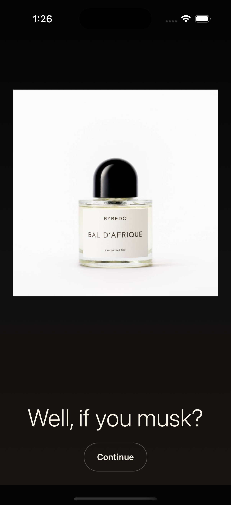

# Scent Lab



Scent Lab is a luxury in-store fragrance discovery app designed to make scent shopping feel less overwhelming and more intentional. Instead of dropping shoppers into a wall of bottles with no direction, it guides them through a quick, elegant consultation based on lifestyle, personality, mood, climate, and wear preference, then recommends the fragrances worth trying first.

The product vision is bigger than a quiz. Scent Lab is meant to fit into store operations, with fragrance availability, recommendations, and merchandising support continuously updated alongside staff workflows. In a L'Oreal-style retail environment, this could be especially strong for the in-store shopping experience: less decision fatigue, better customer guidance, and a clearer path from browsing to purchase.

## What It Does

- Opens with a luxury mobile flow built around a calm, editorial in-store experience
- Profiles shoppers through a staged scent survey
- Recommends fragrances from a live product catalog
- Connects a React Native Expo client to an Express + Prisma + PostgreSQL backend
- Supports a store-ready foundation for live inventory-aware fragrance discovery

## Stack

- React Native with Expo
- Express
- Prisma
- PostgreSQL
- Railway for backend hosting
- Expo EAS for mobile deployment workflows

## Local Run

```bash
cd /Users/winniebrendawaiya/Documents/Playground
docker compose up -d postgres
npm run dev:server
```

In a second terminal:

```bash
cd /Users/winniebrendawaiya/Documents/Playground/apps/client
npx expo start --ios -c
```

## Live Backend

- [Railway API](https://scent-lab-production.up.railway.app/api/health)

